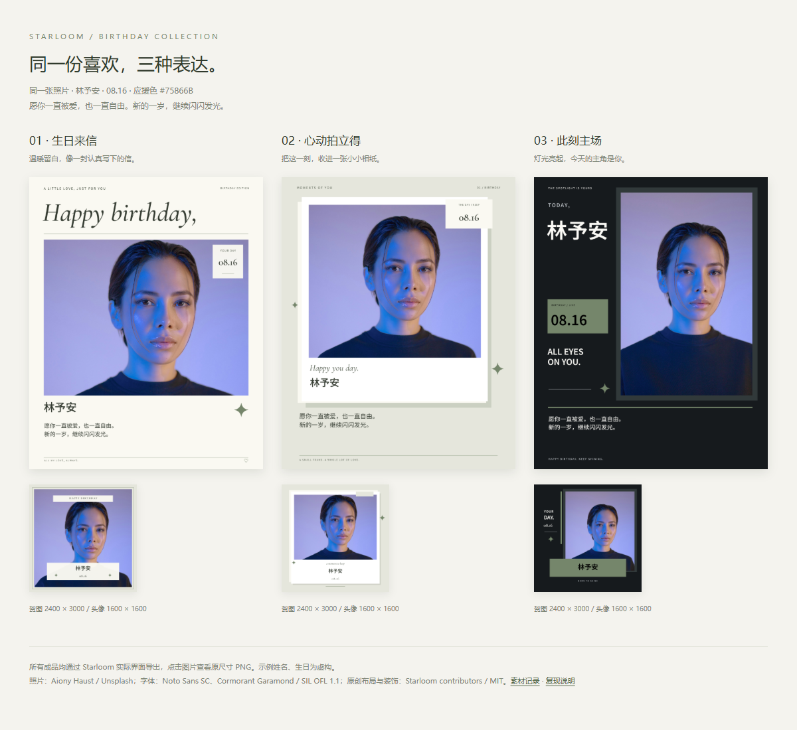

# 星迹 Starloom

**把喜欢，做成作品。**

一个完全在浏览器本地运行的开源物料制作工具。0.3 新增双照片电子小卡，可收藏日常、旅行和见面纪念；保留三套生日主题及配套头像、贺图。无需登录，所有图片处理、作品保存及导出都在本机完成。

## 现在能做什么

- 双照片电子小卡：「上下照片条」与「写真拼贴」两种布局，3:4 竖版，导出 **1800 × 2400 PNG**。支持姓名、短句和可选日期，不要求生日。
- 两张照片独立上传、换图、拖动与缩放；每个布局分别记忆两张照片的位置。换图只重置对应照片在各布局的裁切，另一张保留原位；布局、换图、裁切、文字与配色均支持撤销重做。
- 三套构图各异的主题：「生日来信」的温暖杂志排版、「心动拍立得」的相纸层次、「此刻主场」的深色舞台。每套独立设计头像和贺图。
- 应援头像：1600 × 1600 PNG，展示姓名和生日；支持仅供预览的圆形安全区。
- 生日贺图：2400 × 3000 PNG，4:5 竖版，展示完整祝福。
- 两份作品共用照片、内容、配色和装饰，使用独立布局、独立移动和缩放参数。
- 鼠标与触屏拖动、缩放滑杆、方向键微调、文字编辑、预设与自定义应援色、装饰开关。
- 最近 50 步撤销重做，一次拖动或连续输入合并为一步；支持换图撤销。
- 每套主题分别记住头像、贺图裁切；切换主题保留照片、文案与应援色，并可撤销。首次切换沿用照片中心与缩放并适配边界，切回恢复原位置。换图会重置各主题裁切，撤销换图可以完整恢复。
- 「我的物料」支持本地多作品：真实缩略图、名称、修改时间、新建、继续编辑、复制、重命名和确认删除。
- 默认继续上次编辑的作品；刷新恢复照片、内容及各主题裁切，安全迁移旧版本的单份草稿。
- 导出原尺寸 PNG，手机可下载或点开原图长按保存；不加水印。

没有账号、后台、云同步、社区、AI 生图、自由画布、自动抠图、付费接口、动态物料或打印功能。

## 制作电子小卡

1. 在「我的物料」点击「新建电子小卡」；「新建物料」仍创建原有生日应援作品。
2. 选择「上下照片条」或「写真拼贴」。点击照片 1 / 2 的「换图」分别上传，也可先用示例照片体验。
3. 点击预览中的照片或设置区的照片按钮选择要调整的一张，用拖动、方向键和缩放滑杆裁切。拼贴重叠处优先选中上方的小相纸，也可通过照片按钮选择底层写真。
4. 写下姓名（最多 40 字素）、短句（最多 80 字素）；日期可留空，也可填写年月日后随时取消显示。
5. 选择配色与装饰，点击「导出电子小卡 PNG」。看到「已保存到本机」后再关闭浏览器，下次用相同浏览器资料和站点继续编辑。

卡片中的选中框与照片编号仅供编辑，不进入导出。缩略图、布局选项预览、主预览和实际 PNG 共用 Canvas 渲染器。两张默认示例使用项目已有的同一张授权人像与不同裁切；无需下载新素材。

## 启动

需要 Node.js 22.12+，推荐 Node.js 24 LTS，以及 npm。项目提交了 `package-lock.json`，推荐按锁文件安装：

```sh
npm ci
npm run dev
```

打开终端显示的本地地址，默认是 http://127.0.0.1:5173/ 。

需要在同一局域网的手机上访问时：

```sh
npm run dev -- --host 0.0.0.0
```

在手机中打开终端显示的 Network 地址。生产部署推荐 HTTPS。

## 构建、预览与部署

```sh
npm run build
npm run preview
```

`build` 先执行 TypeScript 检查，再生成 `dist/`。把 **整个 `dist/` 目录的内容** 发布到任意静态托管即可，不需要 Node 服务、数据库、环境变量或 API 密钥。

| 部署方式                        | 设置                                      |
| ------------------------------- | ----------------------------------------- |
| GitHub Pages                    | 发布 `dist/` 内容，入口为 `index.html`    |
| Cloudflare Pages / Netlify      | 构建命令 `npm run build`，输出目录 `dist` |
| Nginx / Apache / 其他静态服务器 | 将 `dist/` 内容复制到站点目录             |

Vite 的 `base` 已设为 `./`，资源采用相对路径，支持 `/starloom/` 等子目录。应用使用单页内部状态切换，没有需要服务器重写的前端路径路由。请通过 HTTP(S) 访问，直接双击 `dist/index.html` 不属于支持的运行方式。

字体、示例照片和许可文件全部随静态文件发布。运行时不请求 Google Fonts、Unsplash、图片代理或第三方 API。首次打开仍需要从你部署的站点加载应用资源；首版未提供 PWA 或离线安装。

## 使用约定

- 照片支持 JPG、PNG、WebP，单文件最多 30 MB。HEIC 请先转换成 JPG。首版针对静态图片；不制作动画。
- 浏览器读取照片方向信息。最长边超过 4096px 时，在本机生成 4096px 工作副本；JPEG 使用高质量 JPEG 副本，其他格式保留透明通道。原文件不变。
- 小照片或过度放大可能使导出照片偏软；高像素导出不会补出原照片中没有的细节。
- 姓名最多 40 个字素，生日祝福最多 200 个字素，小卡短句最多 80 个字素。一个家庭 Emoji 或带组合音标的字母按一个字素计数。支持手动换行、中英文混排和连续长英文。
- 排版会换行并在模板规定的范围内缩小字号。超出字数或文字区域时，内容仍可编辑，应用明确提示并阻止导出，不静默截断。
- 生日只填写月日，允许 2 月 29 日，不计算年龄。
- 调整照片时可使用方向键，按住 Shift 移动更多。输入框外，Ctrl / ⌘ Z 撤销，Ctrl / ⌘ Shift Z 或 Ctrl Y 重做。输入框保留浏览器本身的文字撤销行为。

## 我的物料、本地保存与迁移

在页头打开「我的物料」。首次没有作品时，可新建生日物料或电子小卡；之后默认继续上次编辑的作品。每张卡片展示对应贺图或小卡的真实缩略图与修改时间，按最近修改排序。点击卡片继续编辑，点击更多操作可复制、重命名或删除。名称用于管理作品，不改变图片中的姓名；支持 1～60 个字素。删除需要确认，删除最后一件作品后保持空列表。

新建和复制都生成新 ID，不覆盖已有作品。复制包含照片、内容、主题和全部裁切记忆，副本可独立编辑。进入作品列表前会完成当前保存；保存失败时保留当前会话，可重试或先导出图片。每次打开作品开始独立编辑会话，撤销历史不跨作品或刷新保留。

作品保存在当前站点来源的 IndexedDB（`starloom-local`，数据库版本 2）。`works` 按作品 ID 保存状态、照片 Blob、管理名称、时间和内容版本，`meta` 保存最近编辑作品与迁移标记。项目和照片在同一事务内保存。停止修改约 500ms 后自动保存，离开字段、结束调整、页面转到后台时也会请求保存。

保存队列捕获作品 ID、内容快照与对应照片；小卡的两张照片 Blob 和内容在同一个事务中提交。应用请求严格持久性，事务完成后才显示保存成功；编辑发生时立即标记待保存，旧事务不能替新内容显示成功。「立即保存」可手动提交，成功状态附完成时间；配额等错误提供原因与重试入口。离开作品前等待保存，已离开的上传、解码与渲染任务不会修改下一件作品。

缩略图由同一 Canvas 渲染器生成：生日贺图为 320 × 400，小卡为 300 × 400。异步保存时核对内容版本，失败不影响作品保存；只换第二张照片也会更新版本。删除后的迟到保存不能重新创建作品；缩略图更新和打开作品不会改变内容修改时间。

**从旧版本升级**：保留原 `drafts/current`，将有效草稿复制为 `legacy-current-v1` 作品，保留照片字节、文案、配色、裁切和原保存时间。新作品与迁移标记一起提交，失败一起回滚；原草稿不删除、不覆盖。重复打开不会重复导入，删除迁移后的作品也不会重新导入。损坏或主题未安装的草稿保留原数据并显示提示，仍可新建独立作品。数据库被其他标签页占用时，请关闭其他星迹页面并点击重试。

0.3 继续使用数据库版本 2，原 0.2 作品的 schema 和项目版本仍为 2，不做批量重写。仅新小卡使用 schema / 项目版本 3，新增第二张照片、可选日期与双槽位布局记忆。缺图、损坏、未知版本或缺失布局会报错并保留原记录，不能回退成示例或生日作品。原单份草稿作为一次迁移备份保留在浏览器中；不要通过清理站点数据尝试降级。应用没有项目文件导入导出或云备份功能，PNG 是成品，不含编辑工程。

请看到「已保存到本机」再关闭浏览器，再次打开时使用**同一浏览器、同一资料和相同站点来源（协议、主机、端口）**。例如 `localhost` 与 `127.0.0.1`、5173 与 4173 端口是不同存储位置。已加入完整退出独立 Edge 进程后使用原资料目录重开的自动测试，核对两张照片字节和所有布局；环境与限制见 [TESTING.md](TESTING.md)。

「保存与恢复说明」可按需申请浏览器持久存储。获准可降低自动回收风险，未获准或 API 不可用时仍按普通本地存储保存；不能防止主动清理。无痕窗口结束、清理网站数据、浏览器存储回收或卸载可能移除作品。尚未保存或正在导入时会请求浏览器离开提醒，但不能保证移动系统或强制结束进程会执行回调；最后的修改可能来不及保存。请及时下载重要成品。撤销历史不在重开或刷新后保留。

存储空间不足时，应用显示保存失败，仍允许编辑和导出；新建或复制失败不改变其他作品。本地存储完全不可用时，可选择「临时制作并导出」，此时没有保存能力。损坏或不兼容的作品不会被示例内容自动覆盖，其他可读取的作品仍可管理。本轮不支持多标签页协同编辑，请避免在多个标签页同时修改同一作品。

不设置账户、不上传照片、不收集文本、不使用统计追踪服务。应用只读取用户主动选择的文件。部署站点自身的访问日志由其托管方决定。

## 代码结构与渲染

```text
src/
  templates/     主题清单和两份成品的声明式布局
  core/          类型、裁切、排版、配色、绘图、图片读取、历史和草稿
  hooks/         单个作品的编辑会话、历史状态与保存队列
  components/    预览、主题选择和弹窗
  App.tsx        六步制作流程
  PhotoCardEditor.tsx  双照片电子小卡编辑器
  Workspace.tsx  我的物料、迁移初始化与作品会话切换
  styles.css     响应式应用界面
tests/           浏览器端到端测试
public/
  assets/        随项目发布的示例照片
  licenses/      素材来源与完整字体、图标许可
```

界面使用 React + TypeScript + Vite。作品使用原生 Canvas 2D，不依赖自由画布框架或 DOM 截图库。

`TemplateDefinition` 定义逻辑尺寸、导出尺寸、图层、文字框、字体、配色模式与装饰。`ProjectState` 版本 2 保存内容、主题、照片引用和 `cropsByTemplate[templateId][format]`；`PhotoAsset` 保存照片 Blob 和尺寸信息。`WorkRecord` 是管理层的保存记录，不把作品名称、缩略图或修改时间混入画面内容。

小卡使用 `CardTemplateDefinition.layout` 与 `ArtworkFormat = 'card'`。项目版本 3 在共同字段上新增 `card.secondPhotoId`、`card.date`、`card.cropsByLayout[layoutId][first|second]`；原生日月日和裁切字段仅为兼容共同结构保留，不参与小卡渲染。`asset` 是照片 1，`secondAsset` 是照片 2。`photo-card.ts` 管理双槽位裁切与布局切换；`useEditor` 共用历史、图片资源回收和保存队列。

裁切统一通过 `projectCrop`、`updateCrop` 和 `switchTemplate` 读写。主题选择器使用与实际切换相同的裁切计算，当前内容直接生成各主题预览。新建、复制和删除只由作品管理层处理；编辑器保存接口必须带作品 ID，不能使用可变的“当前作品”指针作为写入目标。

预览与导出均调用 `renderArtwork`。文字按模板逻辑坐标测量排版，加载对应字符所需的本地字体后绘制；屏幕尺寸不会改变换行结果。导出冻结项目和对应照片，单独解码后生成 PNG（生日作品两张，小卡一张），结束后释放绘图资源。预览中的画纸倾斜、阴影、圆形辅助线、照片选中框和操作控件不进入成品。

## 新增模板

1. 复制 `src/templates/birthday-letter.ts` 为新文件，导出一个符合 `TemplateDefinition` 的配置。
2. 设置唯一 `id`、`name`、`subtitle`、`tags` 和灵感配色 `palettes`。可设置 `colorMode: 'dark'`；省略或设为 `'light'` 时沿用旧版明亮配色算法。深色主题可参考「此刻主场」。
3. 分别设计 `layouts.avatar` 和 `layouts.poster`，保留首版正方形头像与 4:5 贺图的成品约定，不能把一张布局直接缩放成另一张。每份布局需要一个 `photo` 图层。
4. 为姓名、祝福设置明确的 `width`、`height`、`size`、`minSize`、`lineHeight` 和 `maxLines`。头像只放姓名及生日；贺图保留完整祝福区域。
5. 在 `src/templates/index.ts` 的 `templates` 数组中注册新配置。主题选择器会自动显示当前照片和文案生成的预览，不需要修改编辑器或另写导出逻辑。
6. 完成长文本、极端宽高比、独立裁切与导出验证，并更新素材许可清单。

```ts
import { birthdayLetter } from './birthday-letter'
import { heartPolaroid } from './heart-polaroid'
import { centerStage } from './center-stage'
import { yourTheme } from './your-theme'

export const templates = [birthdayLetter, heartPolaroid, centerStage, yourTheme]
```

可用图层：`photo`、`text`、`rect`、`line`、`sparkle`。文字 `content` 可以绑定 `name`、`birthday`、`wish`，或写成 `{ literal: '固定文字' }`。颜色使用 `paper`、`ink`、`muted`、`accent`、`soft`、`white`、`onAccent`；渲染器根据应援色与模板明暗模式派生颜色。深色模式的 `ink`、`muted` 为浅色，色块文字使用 `onAccent`；不要把低对比的装饰色直接用于重要文字。

装饰通过 `decoration: 'sparkles'` 或 `'lines'` 绑定开关。现有字体角色为 `sans` 和 `serif`，对应本地 Noto Sans SC 与 Cormorant Garamond。不要为模板引入远程字体、图片或任意 HTML。生日模板保留一个照片槽位；小卡在 `src/templates/photo-cards.ts` 注册，必须有 `slot: 'first'` 和 `slot: 'second'` 两个照片图层，可绑定 `date` 文本，导出尺寸固定为 1800 × 2400。

已发布模板的 `id` 应保持稳定。若要改变已有主题的布局含义，请用新的 `id` 并保留旧主题，避免改变用户恢复的作品。模板 `version` 是元信息；生日作品 schema / 项目版本为 2，小卡为 3；旧单草稿 schema 1 通过上述显式迁移保留。未知版本或缺失主题不能静默替换成默认作品。

## 三套真实成品对比



[打开对照页](docs/theme-comparison/index.html)或查看[成品与复现说明](docs/theme-comparison/README.md)。三套均使用同一示例照片、林予安、08.16、相同祝福和 `#75866B`，通过界面真实导出，附六张原尺寸 PNG。示例人物姓名与生日为虚构，不对应照片人物。

## 测试

```sh
npm test
npm run test:e2e
npm run build
```

单元测试覆盖裁切边界、字素与排版、月份、明暗对比、历史合并、独立作品保存与事务迁移。浏览器测试覆盖原有完整流程，以及三主题真实下载与预览对照、照片比例、长文本、触屏操作、作品复制与删除、保存和上传的异步竞态、刷新恢复、存储失败及旧草稿迁移。

0.3 增加双图独立编辑与布局记忆、小卡实际 PNG 和预览像素对照、损坏记录保护、持久存储提示，以及确认浏览器进程退出后用原测试资料目录重开的恢复验证。生产构建后可另运行：

```sh
npm run test:e2e -- --config playwright.production.config.ts
```

生产验证从 `dist/` 启动 4175 端口预览，覆盖两布局带 / 不带日期的真实下载，以及浏览器重启恢复；报告写入 `.qa/production-results.json`。所有浏览器资料、上传测试图、下载 PNG 和截图都在被 Git 忽略的 `.qa/`，不作为项目素材上传。

端到端测试默认使用本机 Microsoft Edge 的独立无头会话，不读取个人浏览器资料。没有 Edge 时可指定已安装的 Chrome，或使用 Playwright Chromium：

```sh
# macOS / Linux
PLAYWRIGHT_CHANNEL=chrome npm run test:e2e

# PowerShell
$env:PLAYWRIGHT_CHANNEL = 'chrome'
npm run test:e2e
```

若使用 Playwright 自带的 Chromium，先执行 `npx playwright install chromium`，再将 `PLAYWRIGHT_CHANNEL` 设为 `chromium`。测试会自动启动本地站点；报告、截图和下载的 PNG 放在被 Git 忽略的 `.qa/` 目录中。

实际验收范围和限制见 [TESTING.md](TESTING.md)。手机视口与触屏模拟不等同于 iPhone / Android 真机测试。不同系统的 Emoji 和字体回退外观可能不同；同一次编辑的预览与导出使用同一个浏览器、同一套字体与绘图实现。

## 许可

代码与原创几何装饰采用 [MIT](LICENSE)。照片、字体、图标保留各自许可，未统一改授 MIT。完整来源、作者、资源位置和处理记录见 [素材清单](public/licenses/ASSETS.md)。发布源代码或构建产物时，请一起保留 `public/licenses/` / `dist/licenses/`。
